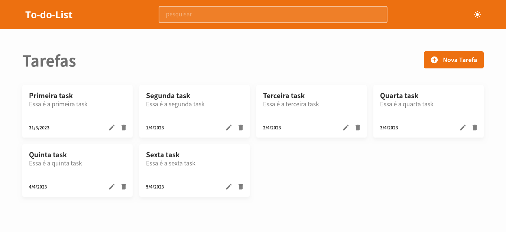

# 📝 ReactJS TODO App

Uma aplicação simples de lista de tarefas criada com **ReactJS** para praticar os fundamentos da biblioteca. Este projeto é uma oportunidade de explorar e dominar conceitos-chave do React. A fonte de aprendizado principal é a [documentação oficial](https://reactjs.org/).

## 🌟 Visão Geral

<div align="start">
  
</div>

> *Uma imagem da tela inicial do projeto TODO App para ilustrar a aplicação.*

## 🚀 Iniciando o Projeto

Para configurar um novo projeto React com TypeScript usando **Vite**, você pode seguir os passos abaixo:

1. Execute o comando abaixo para criar o projeto com Vite:
   ```bash
   # npm 7+, extra double-dash is needed:
   npm create vite@latest my-react-app -- --template react-ts
   ```

2. Siga as instruções que aparecerem no terminal para concluir a instalação.

## 🛠️ Como Executar o Projeto

Para rodar a aplicação em modo de desenvolvimento:

1. Na raiz do projeto, execute:
   ```bash
   npm run dev
   ```

2. Acesse a aplicação no navegador em [http://localhost:5173](http://localhost:5173) (ou a porta configurada).

## 📂 Estrutura do Projeto

```
my-react-app
├── public
│   └── favicon.ico
├── src
│   ├── components
│   ├── App.tsx
│   └── main.tsx
├── .gitignore
├── package.json
└── vite.config.ts
```

## 📝 Funcionalidades

- Adicionar e remover tarefas
- Marcar tarefas como concluídas
- Exibir uma lista de tarefas com filtros

## 🛠️ Tecnologias Utilizadas

- **ReactJS** + **TypeScript**: Para a construção de componentes reutilizáveis
- **Vite**: Como ferramenta de build ultrarrápida
- **CSS Modules**: Para estilização dos componentes
